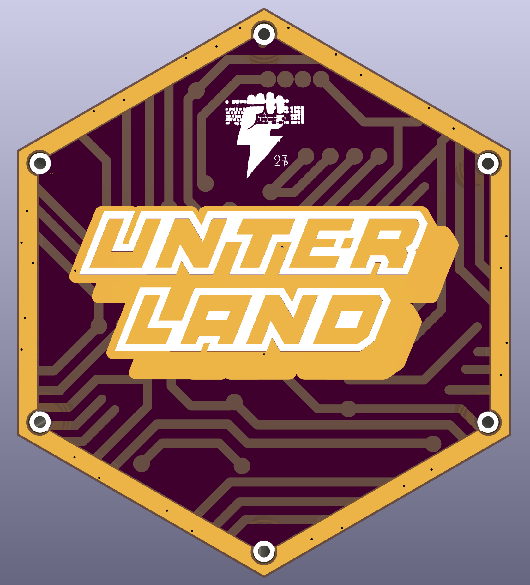
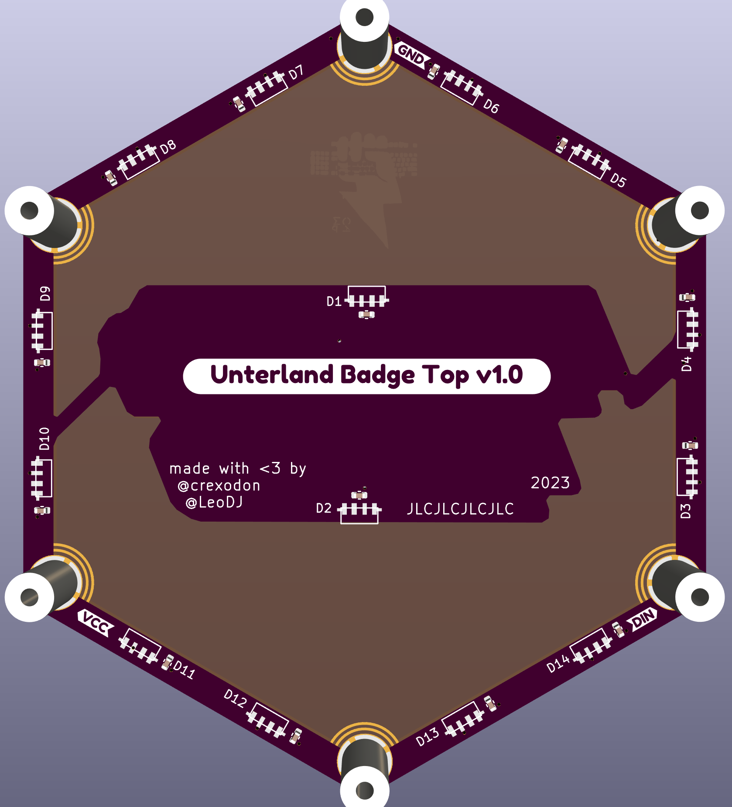
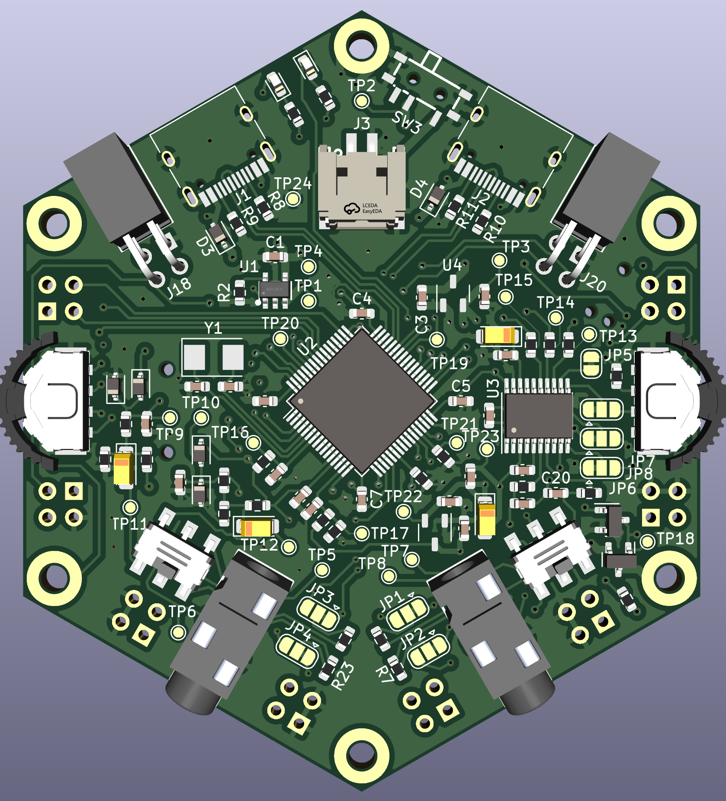
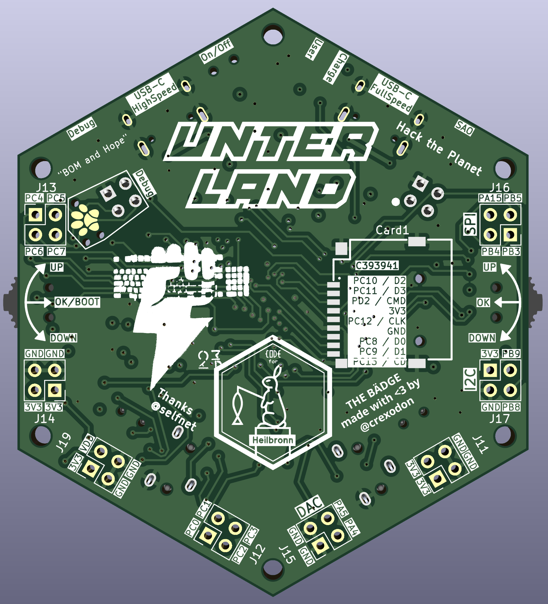

# Unterland Badge
The Unterland Badge is made of two PCBs, Top and Bottom.

## External Parts
- Lithium Polymer Battery with JST PH 2 Connector and Built-In Protection Circuit
  - The max. dimensions are 50mm length x 30mm width x 4mm height
  - The JST PH 2 Connector has pin 1 as positive terminal
  - This Badge does not have any protection against under- or overvoltage. Please make sure the battery has a protection circuit built-in.

- Screws
  - 3x Metal M2 5-7mm
  - 3x Nylon M2 5-7mm

## Badge Top

The Top PCB is made with ENIG finish and has 14 SK6806 RGB LEDs. It is connected to the bottom pcb via 3 of the standoffs.

## Badge Bottom

The Bottom PCB is made with HASL lead-free and has the brains of the badge.
Features:
- WCH CH32V305 Microcontroller
- TI PCM5100 DAC
- 2x USB-C (1x USB High-Speed, 1x USB Full-Speed)
- 2x 3.5mm TRS Audio Jack, for Data and Audio communication with the Fl0wer or other Badges / Equipment
- 2x Rotating Buttons for UI
- TP4054 LiPo charge controller
- Optional Micro SD-Card with SDIO
- Optional GPIOs as 2.54mm Pinheader
